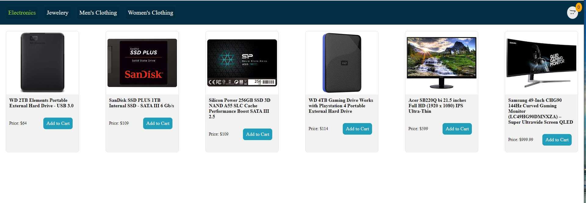
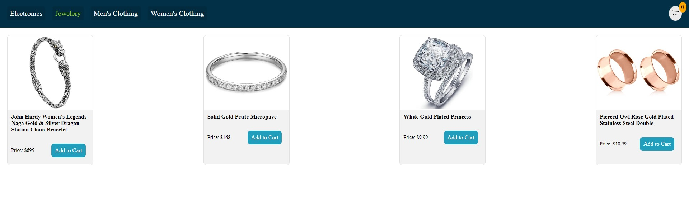
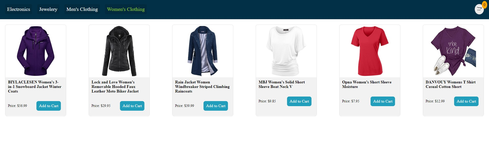

# E-commerce_using_React
## [Live site](https://regal-toffee-36fca5.netlify.app/products/electronics "Have fun on shopping with us")

## overview

An E commerce platform made using React JS, Redux, Fakestore API 

The application is composed of the following Features:

--------------------------------------

## Front end

* A landing page with animated minimalistic design, with the major categories of items. 
* A quick peek page consists of four categories. 
* Done using most optimized code. 
* All form related fields are made using reusable components. 
* Has a cart feature which opens up and displays the items selected in a summary, also has a checkout button. 
* The cart component also allows to edit the contents of the items selected. 

--------------------------------------

# Screen shot

  

  

  

------------------------------------------

# Developed With

* [Visual Studio Code](https://code.visualstudio.com/) - A source code editor developed by Microsoft for Windows, Linux and macOS. It includes support for debugging, embedded Git control, syntax highlighting, intelligent code completion, snippets, and code refactoring  
* [React](https://reactjs.org/) - A javascript library for building user interfaces  
* [Create react app](https://reactjs.org/docs/create-a-new-react-app.html) - A quick method to start developing a react application.  
* [API](https://fakestoreapi.com/) -Used for getting JSON data   

